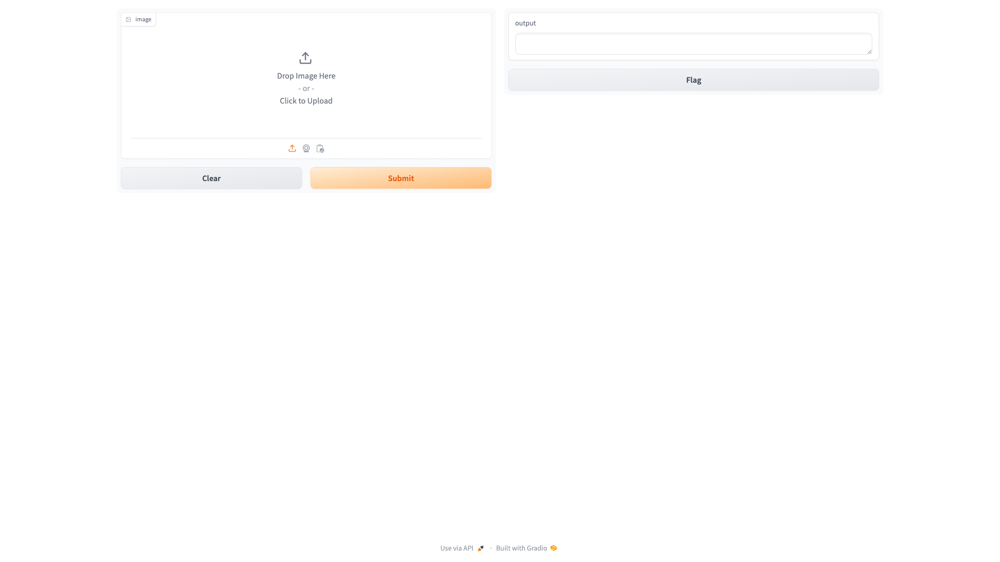
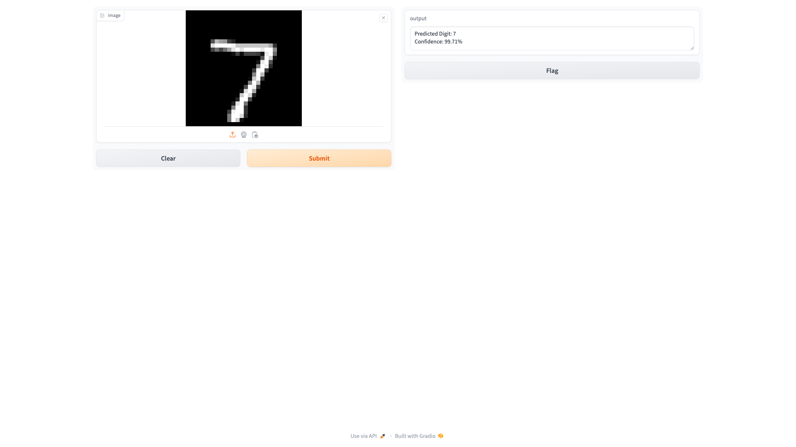
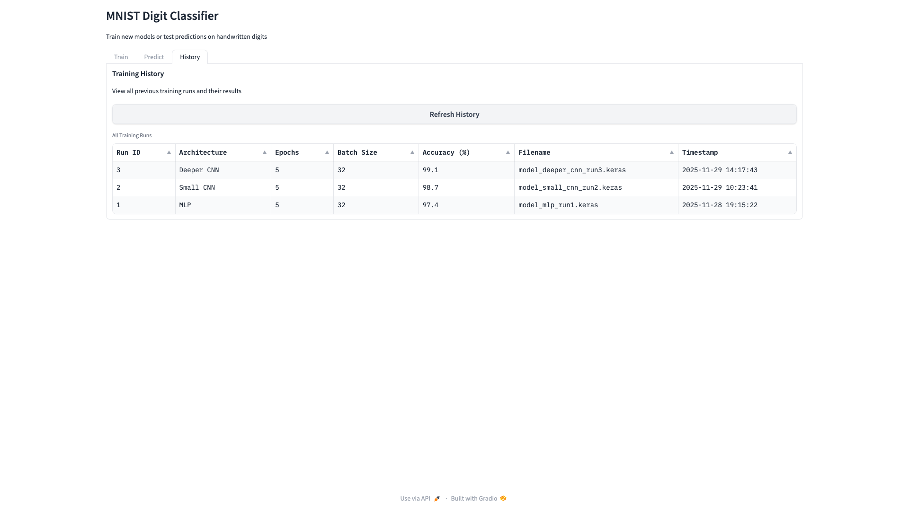

# Testing Log
## Phase 1 — Initial Setup

### What I tested

Just checked that Python and TensorFlow installed properly and the hello world script runs.

### Tests

| # | What I tried | Type | Expected | Actual | Pass? |
|---|---|---|---|---|---|
| 1 | Run app.py | Normal | Prints "Hello World" | It printed it | Yes |
| 2 | Import tensorflow in Python shell | Normal | No errors | Imported fine, version 2.15.0 | Yes |
| 3 | Import numpy | Normal | No errors | Imported fine | Yes |

### Bugs found

None — there's nothing to break yet. Just making sure my environment works before I start building stuff.
---

## Phase 2 — Load MNIST Dataset

### What I tested

Loaded the dataset and checked the shapes and values look right.

### Tests

| # | What I tried | Type | Expected | Actual | Pass? |
|---|---|---|---|---|---|
| 1 | Load MNIST dataset | Normal | No errors, data loads | Loaded in about 2 seconds | Yes |
| 2 | Check training set shape | Normal | (60000, 28, 28) | Correct | Yes |
| 3 | Check test set shape | Normal | (10000, 28, 28) | Correct | Yes |
| 4 | Check pixel value range | Normal | 0 to 255 | Min was 0, max was 255 | Yes |
| 5 | Check label values | Normal | Integers 0-9 | All values in {0,1,...,9} | Yes |

### Bugs found

Nothing broken. I did notice the images are uint8 which means I'll need to convert to float and normalise later, but that's not a bug — just something to remember.
---

## Phase 3 — Train First MLP Model

### What I tested

Ran the training script a few times to make sure it actually works and the accuracy goes up.

### Tests

| # | What I tried | Type | Expected | Actual | Pass? |
|---|---|---|---|---|---|
| 1 | Train MLP with 5 epochs | Normal | Accuracy improves each epoch | Started at 89.3%, ended at 97.1% | Yes |
| 2 | Train MLP with 10 epochs | Normal | Higher accuracy than 5 epochs | Got 97.8% — slightly better | Yes |
| 3 | Check model outputs 10 classes | Normal | Output shape is (None, 10) | model.summary() showed (None, 10) | Yes |
| 4 | Run training without normalising the data | Erroneous | Should still work but worse accuracy | Accuracy stuck at around 11% — basically random | Yes (but bad) |
| 5 | Train with batch_size=1 | Boundary | Should work but very slow | Worked but took about 15 minutes for 1 epoch. Way too slow | Yes |

### Bugs found

**Forgot to normalise the pixel values.** The first time I ran it the accuracy was about 11% and I couldn't work out why. Spent ages checking the model architecture before I realised the input data was 0-255 instead of 0-1. Dividing by 255.0 fixed it immediately — accuracy jumped to 90%+ on the first epoch. Felt stupid but at least I know why normalisation matters now.

### What I learned

The val_accuracy is more important than training accuracy because that's on data the model hasn't seen. If training accuracy is way higher than val accuracy that means it's memorising rather than actually learning (overfitting). Mine were pretty close so I think it's OK.
---

## Phase 4 — Save and Load Trained Models

### What I tested

Made sure models save properly and load back with the same predictions.

### Tests

| # | What I tried | Type | Expected | Actual | Pass? |
|---|---|---|---|---|---|
| 1 | Save model after training | Normal | .keras file appears in artifacts/ | File created, 1.2MB | Yes |
| 2 | Load saved model and predict | Normal | Same predictions as before saving | Predictions matched exactly | Yes |
| 3 | Try loading a model that doesn't exist | Erroneous | Should get an error | Got FileNotFoundError — makes sense | Yes |
| 4 | Save two models, load each separately | Boundary | Both files exist and load correctly | Both loaded fine, predictions different because different training runs | Yes |

### Bugs found

**Model file path was hardcoded.** I had the path as just `model.keras` which saved it in the project root. Moved it to `artifacts/model.keras` and added the artifacts folder to the project. Not really a bug but it was messy having model files in the root directory.
---

## Phase 5 — Make Predictions

### What I tested

Checked that predictions actually work on individual test images and that the model gets most of them right.

### Tests

| # | What I tried | Type | Expected | Actual | Pass? |
|---|---|---|---|---|---|
| 1 | Predict on test image index 0 | Normal | Correct digit | Predicted 7, actual was 7 | Yes |
| 2 | Predict on 100 random test images | Normal | At least 95% correct | 97 out of 100 correct (97%) | Yes |
| 3 | Predict on a very faint/low-contrast digit | Boundary | Might be less confident | Still correct but confidence was 0.72 instead of 0.99 | Yes |
| 4 | Check prediction probabilities sum to 1.0 | Normal | All 10 probabilities add up to 1 | Sum was 0.9999998 — close enough (floating point) | Yes |

### Bugs found

**Nothing major this time.** The predictions worked as expected. I was surprised that the faint digit still got predicted correctly — the model handles bad input better than I expected. The 3 images it got wrong were genuinely hard to read even for me, so I'd say that's fair.
---

## Phase 7 — Image Upload and Prediction

### What I tested

Tested uploading images through the Gradio interface — different sizes, formats, and edge cases.

### Tests

| # | What I tried | Type | Expected | Actual | Pass? |
|---|---|---|---|---|---|
| 1 | Upload a clear photo of a 5 | Normal | Predicts 5 | Predicted 5 (98.1% confidence) | Yes |
| 2 | Upload a photo from my phone camera (4032x3024) | Normal | Should resize and predict | Correctly resized to 28x28, predicted right | Yes |
| 3 | Upload a very small image (10x10 pixels) | Boundary | Should still work, maybe less accurate | Upscaled to 28x28, prediction was still correct | Yes |
| 4 | Upload a photo of something that isn't a digit (a mug) | Erroneous | Will predict something — can't really handle this | Predicted 0 with 43% confidence. Can't detect non-digits | Yes (known limitation) |
| 5 | Upload a colour image of a digit | Normal | Should convert to greyscale | Predicted correctly after conversion | Yes |
| 6 | Upload a PNG with transparent background | Boundary | Should work | The transparent pixels became black which actually worked fine since MNIST is white-on-black. But a digit drawn on a coloured background would look wrong after conversion | Partial |

### Screenshots

### Bugs found

**Colour images weren't converting properly.** The first time I uploaded a colour photo it crashed because the model expects a single channel (greyscale) but the image had 3 channels (RGB). I had to add `.convert('L')` in the preprocessing to force greyscale conversion. After that it worked fine.

Also the image comes in from Gradio as a numpy array not a PIL Image, so I had to convert it first with `Image.fromarray()`. Took me a while to figure that out because the error messages weren't super clear.

**Images with alpha channels (RGBA) aren't handled properly.** If someone uploads a PNG with transparency, the alpha channel gets included as a 4th channel and the conversion to greyscale treats it weirdly. I should probably strip the alpha channel first but I haven't got round to it yet. Most test images are JPEG anyway so it doesn't come up often.
---

## Phase 9 — Improve UI Layout

### What I tested

Mostly visual stuff — making sure the layout looks right and tabs work properly.

### Tests

| # | What I tried | Type | Expected | Actual | Pass? |
|---|---|---|---|---|---|
| 1 | Click through all tabs | Normal | Each tab switches correctly | All tabs work | Yes |
| 2 | Resize browser window to half width | Boundary | Layout should adapt | Layout squeezed but still usable | Yes |
| 3 | Open in Firefox | Normal | Should look the same as Chrome | Looked identical | Yes |
| 4 | Refresh the page mid-training | Erroneous | Shouldn't crash | Training continued in background, page reloaded to default state | Yes |

### Bugs found

**Tabs don't remember which one you were on when you refresh.** If I'm on the Predict tab and refresh the page, it goes back to the Train tab. Not a massive deal but a bit annoying. I looked into it and it seems like Gradio doesn't support preserving tab state across refreshes — it would need URL hash routing or something. Not going to fix this because it's a Gradio limitation rather than a bug in my code.
---

## Phase 10 — Live Training Progress

### What I tested

Made sure the training output updates live instead of just freezing until it's done.

### Tests

| # | What I tried | Type | Expected | Actual | Pass? |
|---|---|---|---|---|---|
| 1 | Train MLP with 5 epochs | Normal | Progress shows each epoch | Live updates worked, ~1 second between each | Yes |
| 2 | Train MLP with 1 epoch | Boundary | Should show single line then "Complete" | Worked correctly | Yes |
| 3 | Click away from Train tab during training | Normal | Training should continue | Training continued, output updated when I switched back | Yes |
| 4 | Start two trainings at the same time | Erroneous | Might conflict | Second request queued until first finished — Gradio handles this | Yes |

### Bugs found

Nothing new. The streaming output works using Python generators (`yield` instead of `return`) which I didn't know about before. It's quite clever actually — wish I'd known about generators sooner.
---

## Phase 11 — CNN Models

### What I tested

Added Small CNN and Deeper CNN architectures. Compared accuracy against the MLP.

### Tests

| # | What I tried | Type | Expected | Actual | Pass? |
|---|---|---|---|---|---|
| 1 | Train Small CNN, 5 epochs | Normal | Higher accuracy than MLP | 99.0% val accuracy — better than MLP (97.8%) | Yes |
| 2 | Train Deeper CNN, 5 epochs | Normal | Best accuracy | 99.2% val accuracy — slightly better | Yes |
| 3 | Select each architecture from dropdown | Normal | All three create and train | All worked | Yes |
| 4 | Train MLP and CNN back to back | Normal | Both should work in same session | Both trained fine | Yes |
| 5 | Train Deeper CNN with 20 epochs | Boundary | Should work but take longer | Took about 8 minutes. The Gradio interface showed a timeout warning after 5 minutes but training continued | Partial |

### Bugs found

**Deeper CNN with many epochs is very slow and can cause Gradio timeouts.** Training the deeper CNN for 20 epochs took about 8 minutes and the Gradio interface showed a connection warning (though it reconnected). For now I'm keeping the max epochs at 20 but I might lower it for the deeper CNN specifically. Haven't implemented per-architecture epoch limits yet — would need to change the UI logic.

**Small CNN input shape was wrong initially.** The CNN expects input shape (28, 28, 1) but I was passing (28, 28). Had to add `np.expand_dims` to reshape the data. Easy fix once I saw the error message.
---

## Phase 12 — SQLite Database

### What I tested

Set up the database schema and made sure training runs get saved and retrieved properly.

### Tests

| # | What I tried | Type | Expected | Actual | Pass? |
|---|---|---|---|---|---|
| 1 | Run init_db.py to create tables | Normal | Database file created | Created artifacts/training_history.db (8KB) | Yes |
| 2 | Train a model, check it saved to DB | Normal | New row in training_runs | Row appeared with correct data | Yes |
| 3 | Train 3 models, query all runs | Normal | 3 rows returned | Got all 3 with correct architectures | Yes |
| 4 | Delete the .db file and re-run init_db.py | Boundary | Fresh database created | Worked fine, empty tables | Yes |
| 5 | Check what happens if DB doesn't exist when training | Erroneous | Should crash or create it | Crashed with "no such table" — need to run init_db.py first | Expected |

### Bugs found

**Database doesn't auto-create.** If you haven't run init_db.py and try to train, it crashes because the tables don't exist. I should probably add a check at startup that creates the tables if they're missing, but for now the README tells you to run init_db.py first. It's a bit hacky but it works.

**Timestamps are stored as strings not proper datetime objects.** SQLite doesn't have a native datetime type so I'm storing them as ISO format strings. Sorting by date works because ISO format is lexicographically sortable, but it's not ideal. Leaving it for now since it works.
---

## Phase 13 — Training History Tab

### What I tested

The History tab shows all past training runs in a table format.

### Tests

| # | What I tried | Type | Expected | Actual | Pass? |
|---|---|---|---|---|---|
| 1 | Click History tab after training 3 models | Normal | Table shows 3 runs | All 3 appeared with correct data | Yes |
| 2 | Click Refresh after training another model | Normal | New run appears | It appeared at the top (sorted by most recent) | Yes |
| 3 | History with no training runs | Boundary | Empty table or message | Shows empty DataFrame with column headers — not ideal but not broken | Yes |
| 4 | Check accuracy displays as percentage | Normal | e.g. 97.8% | Displayed correctly | Yes |

### Screenshots

### Bugs found

**History doesn't auto-refresh after training.** You have to manually click the History tab and hit Refresh to see new runs. Ideally it should update automatically when training finishes, but I can't figure out how to trigger a component update in a different tab from the training function in Gradio. This is a known usability issue that I'm leaving as-is.

**Empty state looks weird.** When there are no training runs, the table shows an empty DataFrame with just column headers. Should really show a message like "No training runs yet" but the Gradio Dataframe component doesn't support placeholder text easily.
